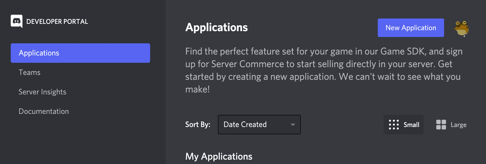
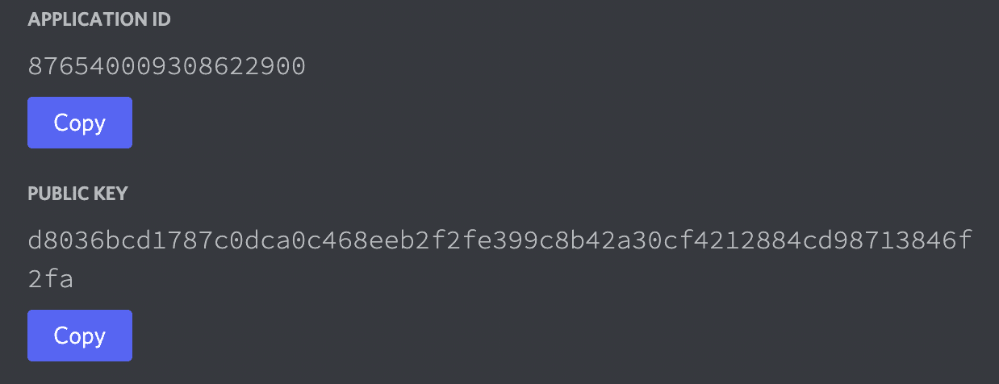
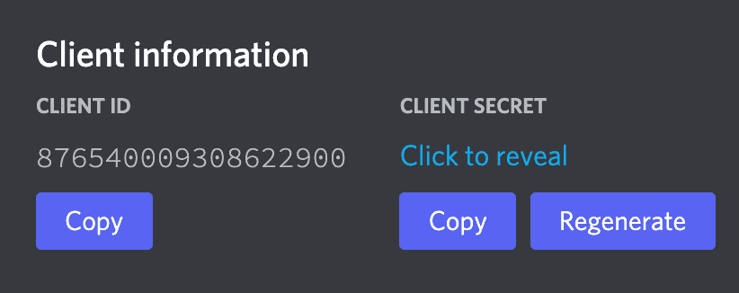
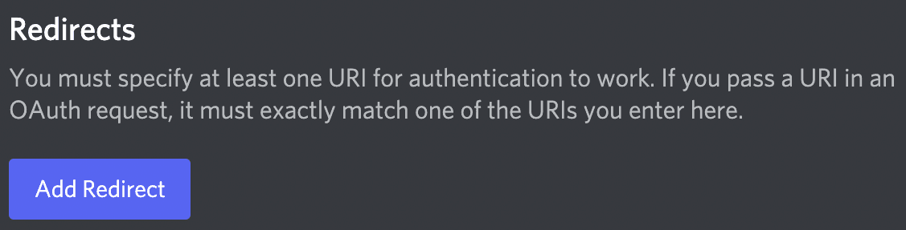
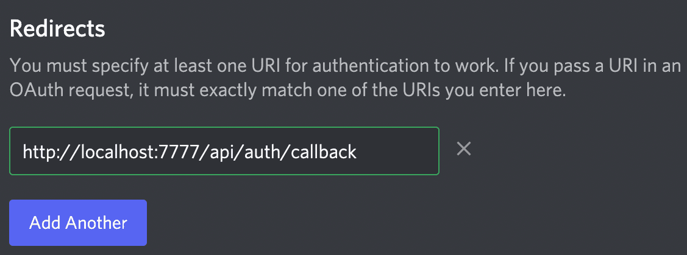
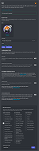

# Discord Setup

Discord setup can be a little involved. Below goes through the current process of getting everything you need to setup your Discord keys.

## Frontend Only

If you're just working on the **frontend** you can simply configure the `.env` variables and skip this entire setup.

In `/packages/api/.env`:

```sh
# used for dev only
FRONTEND_PORT=3000
DISABLE_AUTH=true
```

In `/packages/frontend/.env`:

```sh
# Dev only
REACT_APP_AUTH=http://localhost:3000
REACT_APP_DISABLE_AUTH=true
```

## Start Here:

[Discord](https://discord.com/developers/docs/intro)

You will probably need to make a Discord developer account if you don't already have one. Once you do, you'll need to log in and create a **New Application**. You'll use the same Application for the bot and the OAuth.

## Steps

If you're just setting up the API, you can skip step 5.

1. Create a Application (Both API & Bot)



Name the application anything you want.

2. Get Public Tokens (API)

You'll see a set of tokens after you create an application.

The first 2 you'll see on the first page are the `APPLICATION ID` and `PUBLIC KEY`. You'll need these for the API.



These will go in the `/packages/packages/api/.env` file as the following variables:

```.env
# "APPLICATION ID"
DISCORD_CLIENT_TOKEN=876540009308622900

# "PUBLIC KEY"
DISCORD_PUBLIC_TOKEN=d8036bcd1787c0dca0c468eeb2f2fe399c8b42a30cf4212884cd98713846f2fa
```

3. Get Secret Token (API)

Go to the OAuth link on the left, then you should see a pane that says "CLIENT ID" and "CLIENT SECRET".



We already have the CLIENT ID from the last step, but click copy on the `CLIENT SECRET` and paste it in the .env file next to the DISCORD SECRET TOKEN.

```sh
# "CLIENT SECRET"
DISCORD_SECRET_TOKEN=Lc0GftzqIIOKYKur2qnAMS3fquvCPY1Y
```

\* _Note:_ If you click "regenerate" you'll have to update this token.

4. Create Redirect (API)

Next you need to create a redirect. This is the location that Discord will allow the login to redirect to. You can have multiple redirects, because they are passed in by the server as a URL parameter, but in OAuth the ones you configure here are the only ones that Discord will allow.





This should be in your `.env.example` file already, as it doesn't change unless you change the port or are hosting it through a URL.

```sh
DISCORD_REDIRECT_URI=http://localhost:7777/api/auth/callback
```

5. Create Bot (Bot)

To create a Bot select the Bot on the left menu under OAuth.

You can name this bot anything you want and give it any name you want. But you'll want to do the following:

- Uncheck "Public Bot" under Authorization Flow
- Select "Manage Roles" in the Bot Permissions category
  - (this allows the bot to create roles on the server it joins)

<a href="./discord-bot.png" target="_blank" rel="noopener">
  
</a>

## Final Note

The last `DISCORD_` variable in the `.env` file is `DISCORD_ROLE=portaler` this is simply the role name that is created when the Discord Bot joins a server. This is on bot the Bot and the API and should be the same.
